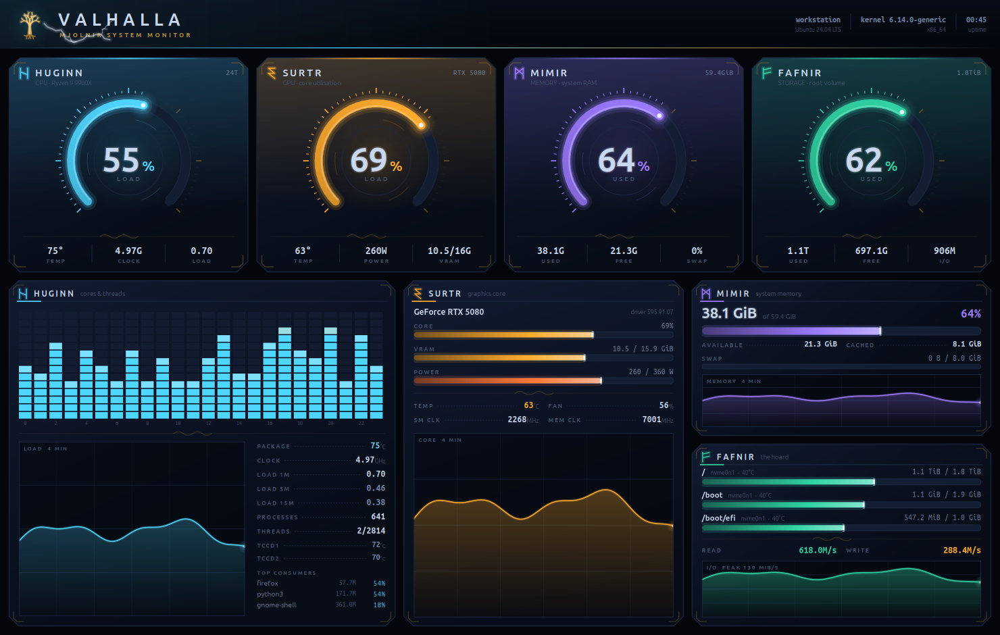
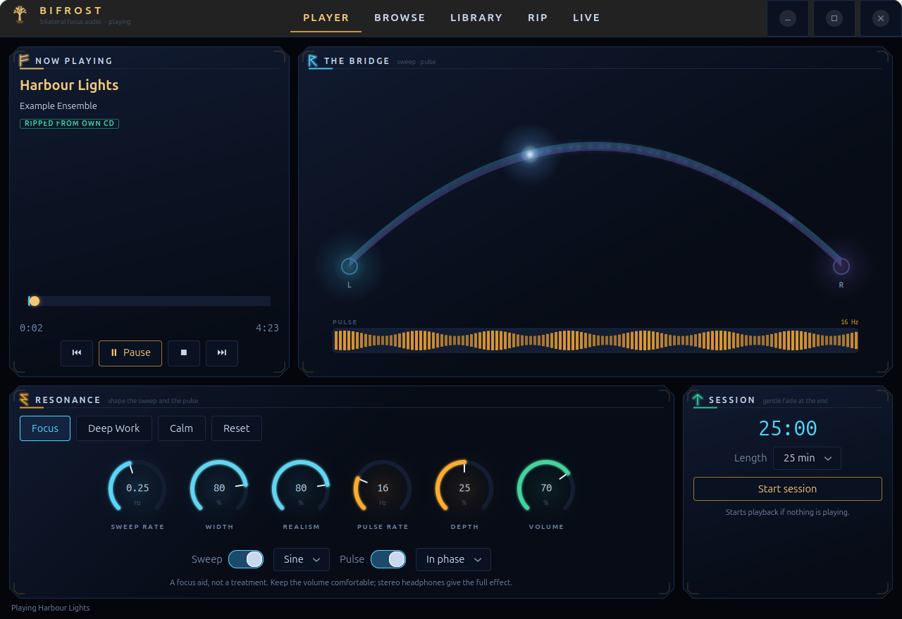

# Valhalla Tools

Two native GTK4 desktop apps for Linux with a shared Norse look: hand-painted
Cairo gauges, glow strokes, runework and cut-corner plates.

| | |
|---|---|
| **[Valhalla Monitor](valhalla-monitor/)** | CPU, GPU, memory and storage dashboard with procedural lightning that fires when a subsystem is genuinely under pressure. |
| **[Bifrost](bifrost/)** | Focus audio: a bilateral left/right sweep plus 16 Hz amplitude modulation applied to any music — your files, free Creative Commons downloads, your own CDs, or any app's audio live. Exports to a folder or a USB drive. |





## Quick start

```bash
# Valhalla Monitor: runs from the source tree, no install step
cd valhalla-monitor && ./valhalla-monitor

# Bifrost: creates a local venv (numpy only), then launches
cd bifrost && ./setup.sh && ./bifrost-audio
```

Both target **Ubuntu 24.04+ / GNOME on Wayland** with PyGObject, GTK 4 and pycairo.
Monitor needs `psutil` (and `nvidia-smi` for the GPU gauge, optional). Bifrost
needs `ffmpeg`, `ffprobe` and PipeWire's `pw-play`, `pw-record`, `pw-cli`,
`pw-dump` and `pw-metadata`; ripping CDs also uses GStreamer's `cdparanoiasrc`.
Each project has its own README with details, an idempotent per-user
desktop-entry installer, and revert instructions.

## Notes

- Bifrost is a **clean-room implementation** of published research on
  amplitude-modulated music and attention. It contains no code or assets from any
  commercial product, and it is a focus aid, not a medical treatment.
- Bifrost's search is honest about what the free libraries hold: popular
  commercial songs aren't in them, so results by a different artist are labelled
  and hidden by default rather than passed off as a match.
- Bifrost's tests (`venv/bin/python3 -m unittest discover -s tests`) use real API
  responses as fixtures and need no network. Its README lists exactly what was and
  wasn't verified on real hardware (CD drive, PipeWire) versus fixtures.
- Screenshots use synthetic data (`valhalla-monitor/tools/_demo.py`,
  `bifrost/tools/render_preview.py`), so they carry no machine identity.
- Music you download through Bifrost stays under its own Creative Commons license;
  the app stores the license and attribution with every track. Rip only discs you
  own.

## License

MIT — see [LICENSE](LICENSE).
