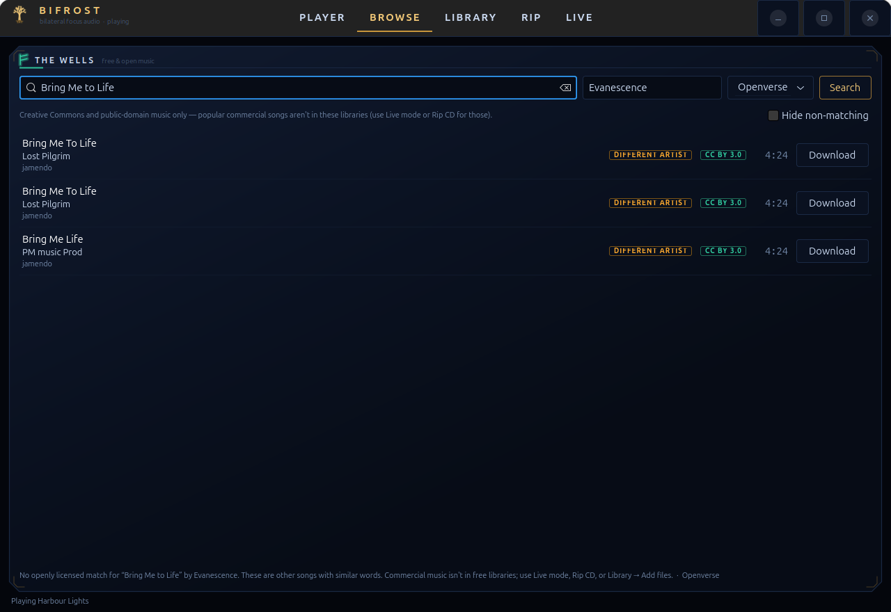
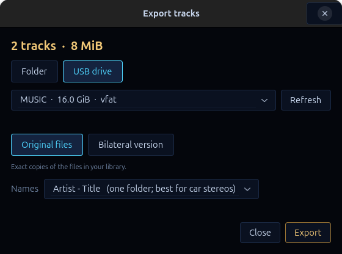
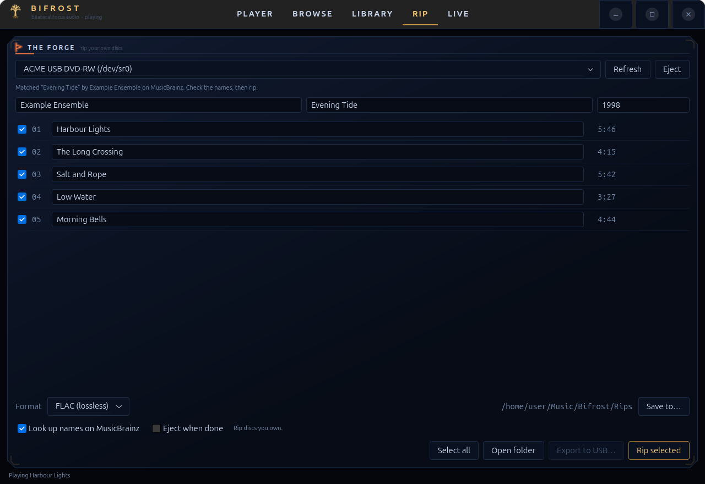
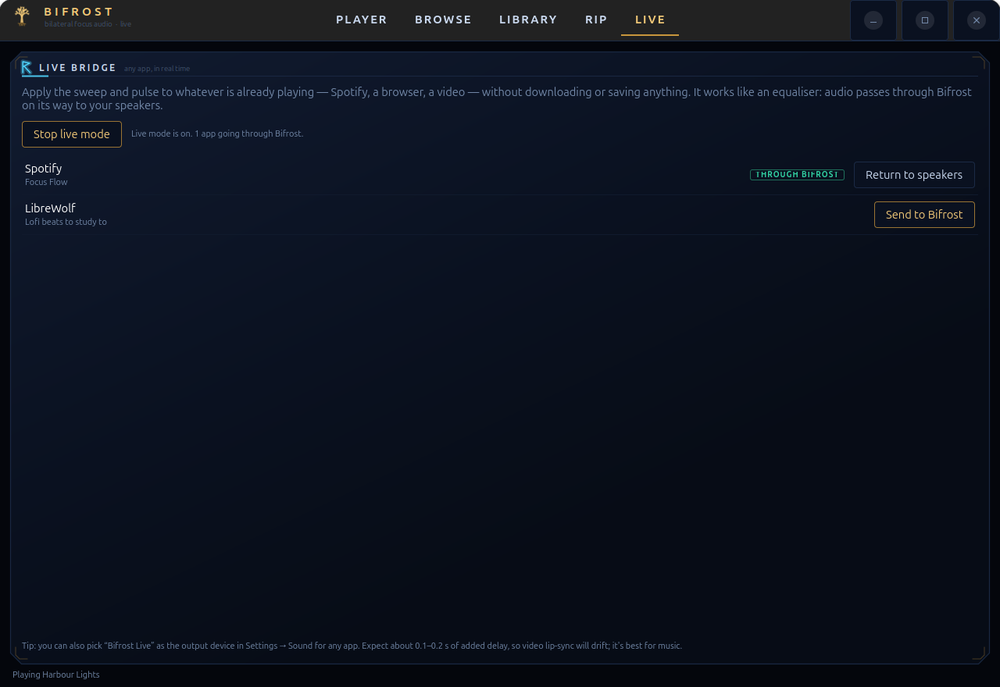

# Bifrost — bilateral focus audio for Linux

A native GTK4 desktop app that turns **any music** into focus audio: a bilateral
sweep between the ears plus 16 Hz amplitude modulation. It plays your own files,
downloads free Creative Commons music, rips your CDs, and can process **any app's
audio live** (Spotify, a browser, a video). Styled to match the Valhalla / Mjölnir
monitor in this repository.


> A focus aid, not a medical treatment. Keep the volume comfortable and use
> stereo headphones — the sweep is meaningless on a single speaker.

## What it is, and where the idea comes from

The best-evidenced app in this space is **Brain.fm**: a 2021 *Communications
Biology* study found amplitude-modulated music (strongest around 16 Hz) improved
sustained attention, with larger benefit at higher ADHD symptom scores.
Panning-only "8D audio" apps are popular but have much weaker evidence.

Bifrost is a **clean-room reimplementation of the published technique**, not a
copy of any product: Brain.fm is proprietary and server-generated, so nothing was
decompiled or taken. Compared with the apps surveyed:

| | Typical apps | Bifrost |
|---|---|---|
| Source audio | their library only | **any file**, free-music browser, **your CDs**, or **any app live** |
| Bilateral cue | volume swap | volume **+ inter-ear delay (≤0.7 ms) + far-ear head shadow** |
| Modulation | fixed | pulse rate 8–40 Hz, depth, in-phase or alternating L/R |
| Control | presets | presets **and** every parameter live |
| Safety | — | soft limiter at −3 dBFS, fade-in, volume cap, session fade-out |
| Privacy | account, telemetry | fully local, no account |
| Attribution | — | license, author and source kept with every track |

## Quick start

```bash
./setup.sh                    # venv (system-site-packages) + numpy; asks first
./bifrost-audio               # launch the GUI
./bifrost-audio selftest      # ffmpeg -> DSP -> pw-play on a quiet tone; checks tools and drive
./bifrost-audio selftest --live   # also queries Openverse and the Internet Archive
./bifrost-audio cd info       # read-only: show the disc in the drive and look it up
./install-desktop-entry.sh    # optional: add to the GNOME app grid
```

Requires `ffmpeg`, `ffprobe`, PipeWire (`pw-play`, `pw-record`, `pw-cli`, `pw-dump`,
`pw-metadata`), GTK 4 and PyGObject. CD ripping also uses GStreamer's
`cdparanoiasrc` (`gst-launch-1.0`). `setup.sh` adds only numpy, inside `./venv`.

| Keys | |
|---|---|
| Ctrl+1 … 5 | Player / Browse / Library / Rip / Live |
| Ctrl+Space | play / pause |
| Ctrl+Q | quit |
| Knobs | drag, scroll, arrow keys; double-click or Esc resets |

## The five tabs

### Player
Pick a preset (Focus, Deep Work, Calm, Reset) and adjust. *Sweep* moves the sound
left↔right; *Realism* scales the inter-ear delay and head shadow; *Pulse* is the
amplitude modulation. **Session** runs a timer that fades out gently at the end.

### Browse — free music, with an honest search
Search **Openverse** or the **Internet Archive**; only Creative Commons /
public-domain results are shown. Add the **Artist** if you know it.



These libraries do **not** contain popular commercial songs. Searching for one
used to return unrelated free songs that happen to share the title, which looked
like success. Now every result is checked against the song and artist you typed:
mismatches are labelled **DIFFERENT ARTIST** / **PARTIAL MATCH**, hidden by default
when you gave an artist, and the status line says plainly what was and wasn't
found. (Openverse silently ignores its own `creator` filter, so this matching is
done in the app.)

### Library — and saving or exporting your tracks
Everything downloaded, ripped or imported. Select tracks (or none, for all) and:

- **Save copies…** copies them to any folder;
- **Export to USB…** copies them to a USB drive, with a **Safely remove drive**
  button afterwards.



The export dialog writes either the **original files** or a **bilateral version**
rendered through your current settings (FLAC or MP3). Names can be flat
(`Artist - Title`, best for car stereos), `Artist/Title`, or
`Artist/Album/NN - Title`. On FAT drives, names are made FAT-safe and files over
4 GiB are skipped; space is checked before anything is written; files are written
to a temp name, flushed to disk, then renamed, so unplugging mid-copy never leaves
a truncated track that looks finished. Creative Commons tracks get an
`ATTRIBUTION.txt` beside them. Tracks under a **no-derivatives** license can be
copied but not exported as processed versions.

*Remove* only deletes files Bifrost downloaded (re-downloadable). Ripped and
imported tracks are only taken off the list.

### Rip — your own CDs
Insert an audio CD, open the tab. Bifrost reads the table of contents, computes the
disc ID and asks **MusicBrainz** for the track names by *exact* disc ID (the fuzzy
TOC lookup returns unrelated releases and is deliberately not used). Every name is
editable; a disc MusicBrainz doesn't know is still rippable.



- **Save to…** chooses the folder the files go in (default `~/Music/Bifrost/Rips`);
  files land as `Artist/Album/NN - Title.flac`.
- Formats: **FLAC** (lossless, default), MP3 (V0), Opus 128k, Ogg q5.
- Reads use GStreamer's error-correcting `cdparanoiasrc` (`paranoia-mode=full`),
  then ffmpeg encodes and tags. A track whose length doesn't match the disc's
  table of contents is rejected rather than saved.
- Untick *Look up names on MusicBrainz* to keep the disc ID off the network.
- Data tracks on mixed-mode discs are shown but can't be ripped as audio.
- Rip discs you own; copyright rules differ by country.

`./bifrost-audio cd info` is a read-only way to check a drive; `cd rip` rips from
the terminal (`--out`, `--format`, `--tracks 1,3,5-7`).

### Live — any app, in real time
Process whatever is already playing (Spotify, a browser tab, a video) without
downloading or saving anything. It works like an equaliser: audio passes through
Bifrost on its way to your speakers.



Press **Start live mode**, then **Send to Bifrost** next to an app. Press
**Return to speakers** or stop, and it goes straight back. Under the hood:

```
app ──▶ [Bifrost Live] virtual sink ──monitor──▶ pw-record ──▶ DSP ──▶ pw-play ──▶ speakers
```

- The virtual sink is hosted by a `pw-cli` child, so if Bifrost crashes the sink
  vanishes and apps fall back to your speakers on their own. On a normal exit every
  moved app is returned first.
- The output is always an explicit real device, never the virtual sink, so it can't
  feed back into itself.
- **Costs:** about 0.1–0.2 s of added delay, so video lip-sync will drift (it's best
  for music), and you control playback from the other app (no seeking in Bifrost).
- Nothing is extracted from the app or written to disk; whether a service's terms
  permit routing its audio through an effects processor is for you to check.
- You can also pick "Bifrost Live" as the output device in Settings → Sound.

## How it works

```
file ──ffmpeg──▶ f32 PCM ──▶ Pan ──▶ AmpMod ──▶ volume ──▶ limiter ──pw-play──▶ speakers
                  (pipe)     sweep+ITD  16 Hz     ramped    -3 dBFS     (pipe)
                             +shadow
```

- **No PortAudio.** Its open/close churn through PipeWire's ALSA shim segfaulted in
  testing. Every audio edge is a subprocess instead, so there is no callback to
  race; stopping is `kill()`.
- **Chunk-invariant DSP.** Phase and filter history carry across ~20 ms blocks, so
  parameter changes land within ~0.2 s with no clicks; tests assert that one-block
  and many-block processing are identical.
- **Hardened downloads.** https only; host allowlist (label-boundary suffix match);
  redirects re-checked; audio type required; 200 MB cap enforced from
  `Content-Length` *and* while streaming; `ffprobe` must find an audio stream
  before the file is renamed into place; filenames come from sanitised metadata.

## What has and hasn't been verified

Verified on real hardware while building this: the CD path end to end (table of
contents, exact MusicBrainz match, a rip whose length equalled the disc's sector
count, a FLAC that decodes bit-identical to the ripped data, tagged MP3/FLAC), the
GUI's rip flow against a real disc, and live mode against the real PipeWire graph
(virtual sink, rerouting a running stream, capturing a 440 Hz tone back at
443 Hz, restoring the stream to the real output, cleanup after exit).

**Not** verified: exporting to a real USB stick (the discovery, FAT handling and
copy engine are tested against a fixture shaped like real `lsblk` output and
temp folders, but no stick was attached), live mode with a real Spotify stream
(tested with a `pw-play` stream), and the sound itself on your headphones.

## Layout

```
bifrost-audio  setup.sh  install-desktop-entry.sh  bifrost-audio.png
bifrost/   dsp.py  engine.py  presets.py  session.py  library.py  settings.py
           downloader.py  export.py  cd.py  cdcli.py  musicbrainz.py  live.py
           sources/{openverse,archive,match,common}.py
           ui/{widgets,player,browse,library_view,rip_view,live_view,export_dialog,style}.py
           app.py  theme.py (palette copied from ../valhalla-monitor)  selftest.py
tools/     render_preview.py (snapshots every view to PNG)   make_icon.py
tests/     headless; fixtures are real API responses
docs/      screenshots (synthetic data only)
```

## Tests

```bash
venv/bin/python3 -m unittest discover -s tests
venv/bin/python3 tools/render_preview.py /tmp/shots --track some.mp3
BIFROST_PW_TEST=1  venv/bin/python3 -m unittest tests.test_live       # real PipeWire, quiet tone
BIFROST_RIP_TEST=1 venv/bin/python3 -m unittest tests.test_gui_rip    # rips a real track from a real disc
```

The suite covers, among other things: the pan law keeps constant power; the LFO,
inter-ear delay and modulation land at their requested rates and depths; the disc
ID matches real MusicBrainz TOC→ID pairs; the downloader refuses unlisted hosts,
off-list redirects, non-audio, fake audio and oversize or unbounded streams; the
wrong-artist search case; rip, export and live flows through the real widgets.

## Revert

```bash
rm -rf /path/to/bifrost                    # the app and its venv
rm -f ~/.local/share/applications/bifrost-audio.desktop \
      ~/.local/share/icons/hicolor/256x256/apps/bifrost-audio.png
rm -rf ~/.local/share/bifrost              # library index and settings (music stays in ~/Music/Bifrost)
```
