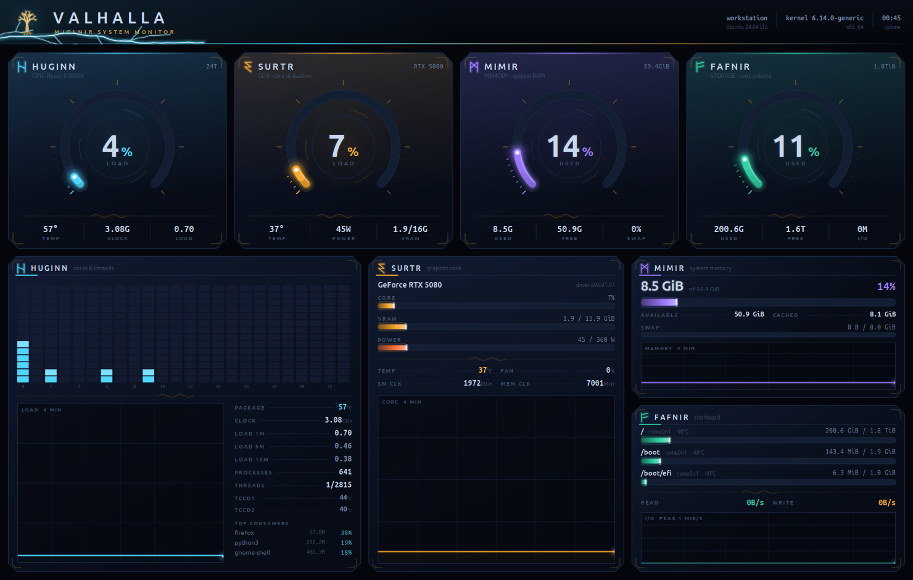
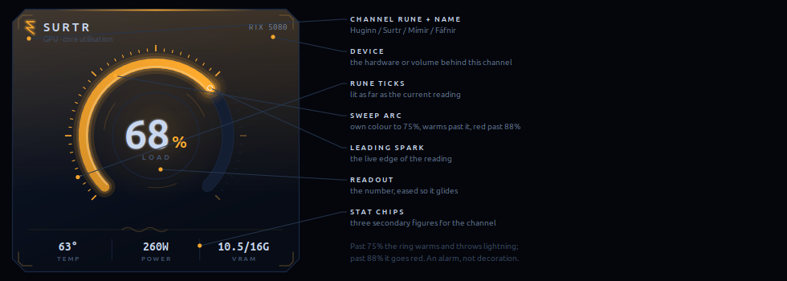
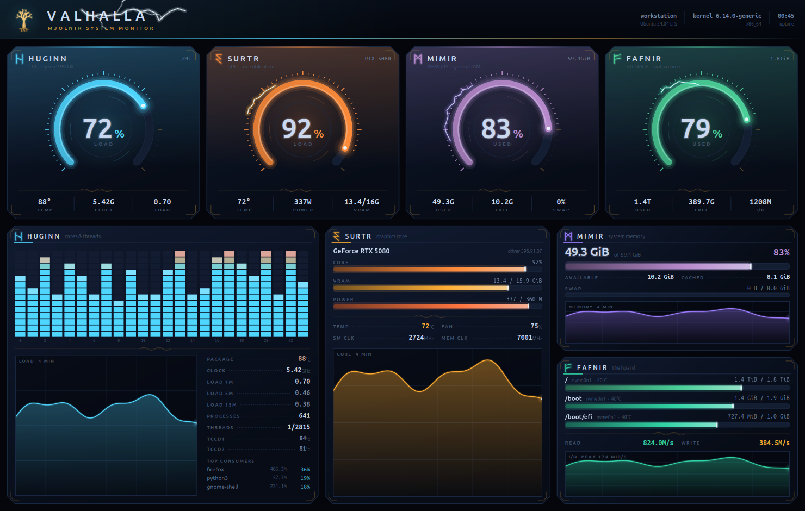
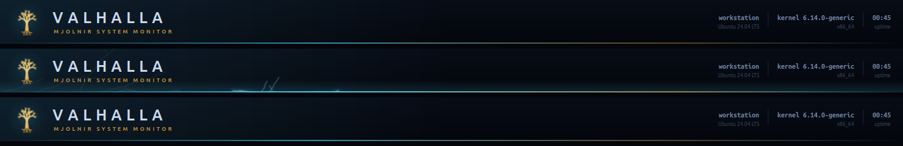
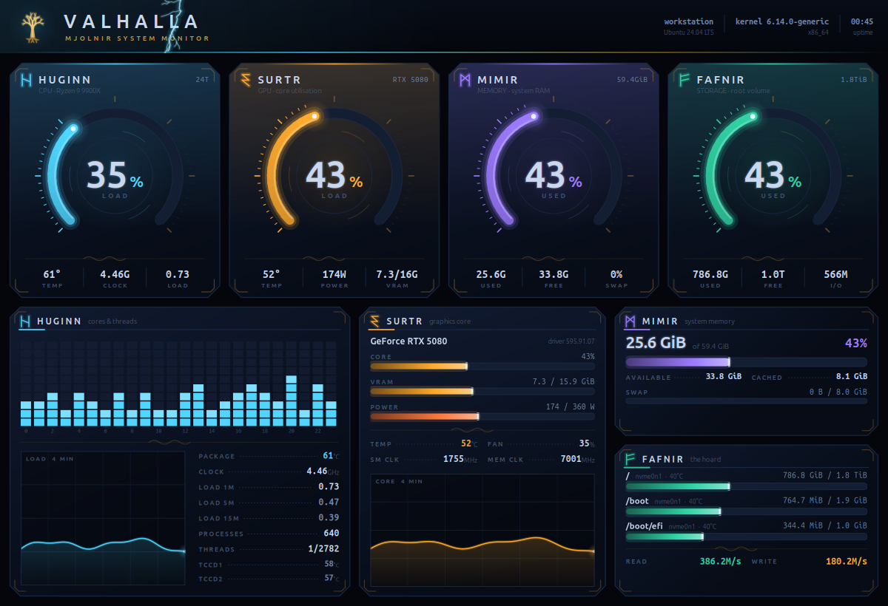

# Valhalla — Setup Guide

A desktop dashboard for CPU, GPU, memory and storage on **Valhalla**, in a Norse
storm theme. This guide covers installing it, reading it, tuning what it costs,
and undoing all of it.

For the design and engineering notes, see [README.md](README.md).


---

## 1. What you need

Nothing needs installing beyond these packages — there is no virtualenv and no
build step.

| Requirement | Needed |
| --- | --- |
| Python 3.14 | required |
| PyGObject / GTK 4.22 | required |
| pycairo | required |
| psutil | required |
| `nvidia-smi` | optional (NVIDIA driver) |

`nvidia-smi` is the only optional one. Without it the GPU gauge reads `OFFLINE`
and the other three channels carry on unaffected.

> **Why GTK4 and not Qt?** PyQt6 wheels for Python 3.14 were unreliable when
> this was built, and GTK4 + Cairo ships with a stock Ubuntu desktop.

---

## 2. First run

No install step, no virtualenv — it runs straight from the source tree:

```bash
./valhalla-monitor
```

That's it. If the window opens and the gauges sweep up from zero, you're done
and section 3 is optional. On an idle machine it looks like this — calm, with
the rings in their own colours and no lightning on any gauge:



---

## 3. Adding it to the GNOME app grid

```bash
./install-desktop-entry.sh
```


The installer:

- writes **only** to per-user paths under `~/.local/share` — no root, no system
  units, nothing outside your home directory;
- prints exactly what it will create and **waits for confirmation**;
- backs up anything it would overwrite as `<file>.bak.<epoch>`;
- is idempotent — re-running rewrites the same two files and nothing else;
- validates the result against what actually landed on disk.

It registers the app to launch with `--calm --fps 15` (see section 5). To change
that, edit the `FLAGS=` line near the top of the script and re-run it.

Afterwards, search **"Valhalla"** in the Activities overview.

> **The icon didn't change / still shows the old one.** GNOME caches icons per
> session. Log out and back in.

---

## 4. Reading the dashboard

### The four channels

| Channel | Name | Shows |
| --- | --- | --- |
| CPU | **HUGINN** — Odin's raven, *thought* | load across all 24 threads, package and per-die temps, clock, load averages |
| GPU | **SURTR** — the fire giant | core utilisation, VRAM, power against cap, temperature, clocks, fan |
| Memory | **MÍMIR** — the well of *memory* | used vs available, cache, swap |
| Storage | **FÁFNIR** — the dragon on the hoard | per-filesystem usage, drive temperature, live read/write rates |

### Anatomy of a gauge



Two thresholds, and they are **not** the same one:

- **past 75%** — the colour warms *and* the ring starts throwing lightning,
  with strikes getting more frequent the further past it you go;
- **past 88%** — the colour goes red.

The lightning is an alarm, not decoration. If a ring is crackling, that
subsystem is genuinely under pressure.



### The banner



Yggdrasil, the world tree — the same mark as the app icon — plus host, kernel
and uptime on the right. The ambient lightning here is decorative and carries no
reading.

### Below the gauges

The detail deck expands each channel: the 24-thread matrix and load trend for
HUGINN, full telemetry and a utilisation trend for SURTR, and memory and storage
breakdowns on the right. The trend graphs cover `240 samples × your interval` —
4 minutes at the default, and the label always states the real span.

---

## 5. Choosing a performance profile

The dashboard's own cost is measured, not estimated. On the author's Ryzen 9 9900X:

| Configuration | One core | Whole machine (24 threads) |
| --- | --- | --- |
| `--fps 60` | 46% | 1.9% |
| default (`--fps 30`) | 25% | 1.0% |
| **`--calm --fps 15`** ← what the desktop entry uses | **8%** | 0.3% |
| `--calm --fps 10 --interval 2` | 3% | 0.13% |

**`--calm --fps 15` is the recommendation.** It loses no data whatsoever — every
number, bar and graph is identical — and drops only the ambient gauge rotation.

Two things worth knowing before you tune further:

- **Don't go below 15 fps.** The lightning flicker runs at 7.5 Hz, so 15 fps is
  its Nyquist floor. At 10 fps the strikes alias into a random stutter instead of
  reading as flicker, and it saves under one point of CPU.
- **`--interval` has an accuracy price the other flags don't.**
  `psutil.cpu_percent` is a delta since the previous call, so at `--interval 2`
  every CPU figure is a two-second average — a 0.5 s burst to 100% displays as
  25%, and disk I/O rates flatten the same way. It hides exactly what you opened
  a monitor to see, for about one point of CPU. Leave it at 1.

Even the default 25% of one core is **1% of this 24-thread machine** — it only
really matters if you park the dashboard on a second monitor all day.

### All options

| Flag | Default | Effect |
| --- | --- | --- |
| `--interval SECONDS` | `1.0` | hardware sampling period |
| `--fps N` | `30` | repaint cap |
| `--calm` | off | drop ambient animation; repaint only when a reading changes |
| `--fullscreen` | off | start fullscreen |

**Keys:** `F11` fullscreen · `Esc` leave fullscreen · `Ctrl+Q` quit

---

## 6. Window size

Default 1480×940, floor 1200×820. Below the floor the panels drop sections
cleanly — trend graphs go first — rather than clipping text mid-glyph:



The four-across gauge row is what sets that floor. A stacked layout for narrow
windows would be a real change, not a tweak.

---

## 7. Troubleshooting

**`install-desktop-entry.sh: command not found`**
The shell only searches `$PATH` for bare names, and `.` is deliberately not on
`$PATH` on Ubuntu. Use the full path, or `./` from inside the directory:

```bash
cd valhalla-monitor && ./install-desktop-entry.sh
```

**GPU gauge reads `OFFLINE`**
`nvidia-smi` isn't answering. Check it directly:

```bash
nvidia-smi --query-gpu=name,utilization.gpu --format=csv
```

The other three channels are unaffected either way.

**Nothing appears in the app grid**
Confirm the entry resolves and points where you expect:

```bash
grep Exec ~/.local/share/applications/valhalla-monitor.desktop
```

Then log out and back in — GNOME caches both the desktop database and icons.

**It moved and now the launcher is broken**
The `.desktop` entry hardcodes an absolute `Exec` path. Re-run the installer
from the new location to repoint it.

**CPU temperature shows `--`**
The package temperature comes from k10temp `Tctl`. Verify the sensor exists:

```bash
python3 -c "import psutil; print(psutil.sensors_temperatures().get('k10temp'))"
```

---

## 8. Uninstalling

Remove the app-grid entry (the source tree is untouched by this):

```bash
rm -f ~/.local/share/applications/valhalla-monitor.desktop ~/.local/share/icons/hicolor/256x256/apps/valhalla-monitor.png && update-desktop-database ~/.local/share/applications
```

Backups from earlier installs, if any, are alongside those paths as
`*.bak.<epoch>` and can be deleted freely.

To remove the app entirely, delete the project directory. It
writes no config, no cache and no state anywhere else.

---

## 9. Regenerating the figures

Every image in this guide is a true render — the generator calls the same draw
functions the running app calls, so the figures cannot drift from what the
window actually shows. Host name, kernel and process names are replaced with
synthetic values (`tools/_demo.py`), so published figures carry no machine
identity. That is also the only option here: Wayland blocks desktop
capture on the author's Wayland desktop and GTK4 dropped `Gtk.OffscreenWindow`.

```bash
python3 tools/make_docs.py    # every figure in docs/
python3 tools/make_icon.py    # the app icon
```
